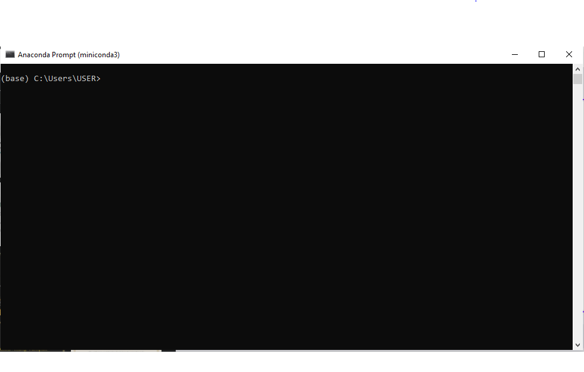

# Tugas-Akhir-Pemos-Team-3
Repositori ini dibuat untuk memenuhi Tugas Akhir Praktikum Pemodelan Oseanografi 2022. Repositori ini memuat executable (.exe) file yang dapat memproses beberapa persamaan model hidrodinamika untuk penyelesaian dalam pemodelan dari suatu fenomena atau dinamika oseanografi.
Pengerjaan untuk repositori kali ini menggunakan bahasa pemrograman python yang dapat dilakukan pada beberapa platform seperti Google Colaboratory dan Jupyter Notebook. Sedangkan untuk library yang digunakan kali ini adalah Numpy, Matplotlib, dan Pprint. Seluruh script yang dibuat adalah hasil Team 3 Oseanografi 2020. Semoga dapat bermanfaat!

# 1. AUTHORS TEAM 3
1. Hanna Sazidah 26050120120002 A
2. Sinta Dwi Rosalia 26050120120019 A
3. Savira Aulia Zahra 26050120140154 B
4. Bussan Adi Nugroho 26050120130100 A
5. Fani Melisa 26050120140090 B
6. Yosefa Pramudita 26050120140151 B
7. Adzkia Fara Ananda 26050120120014 A

# 2. Teori Dasar Model Hidrodinamika
sebelum ke metodenya jelasin dulu soal pengertian Model Hidrodinamika, dasar simulasi model (parameter dan anomali jelasin), persamaan persamaan dan perbedaan model hidrodinamika 1D dan 2D (dikerjain sama 2 orang)

# 3. Pembuatan Script Python (ipynb)
Pembuatan Script Pyhton dapat dilakukan dengan menggunakan Miniconda atau menggunakan Google Colaboratory. Setup Miniconda dapat diunduh pada File Terlampir
Adapun langkah pembuatan script sebagai berikut :
1. Pengguna dapat mengunduh setup miniconda terlebih dahulu kemudian dilakukan instalasi
2. Setelah itu, pengguna dapat membuka Anaconda Prompt 

# 4. Metode Pengerjaan
step by step maksud script modul 3 (flowchart dan script python yang digunakan mulai dari persamaan hidrodinamikanya, persamaan pembangun, persamaan transport, diskretitasi, penyelesaian analitik). bagian ini cara nulisnya sama kaya yang contoh asisten kirim. (dikerjain sama 3 orang)

# 5. Kegunaan dan Penerapan Script dalam Oseanografi
ini lebih ke penjelasan dari kegunaan dan penerapannya di ose bisa buat apa aja, tambahin kekurangan dan kelebihan dari penggunaan model hidrodinamika

# 6. Penutup
yang kebagian ini berarti otomatis nulis juga bagian kegunaan dan penerapan script (dikerjain sama 1 orang)

# 7. Referensi
Diisi jurnal atau buku semisal mengambil materi dari pustaka
